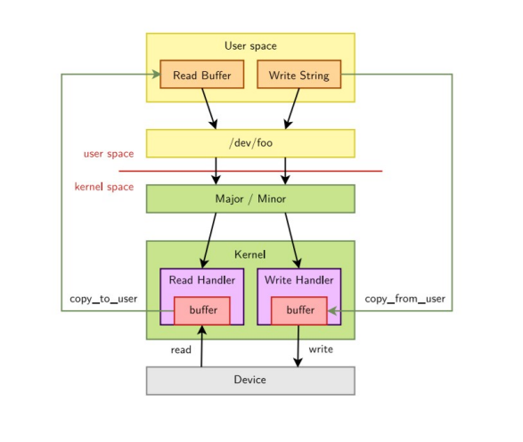

# Character Device Drivers in Linux

Character devices transfer data to or from a user application by means of **characters**, in a **stream manner** (one character after another), similar to how a **serial port** works.

A character device driver exposes the properties and functionalities of a device through a **special file in the `/dev` directory**. This file is used to:

- Exchange data between the device and the user application.
- Control the real physical device.

This illustrates the basic Linux concept that **"everything is a file."**

---

## Basic Concept

A **character device driver** is the most basic form of device driver in the Linux kernel source.

From the perspective of an application, a character device is essentially treated as a **file**.

---

## File Operations

To enable this behavior, the character device driver must implement file-like operations such as:

- `open`
- `close`
- `read`
- `write`

These operations are defined in the `struct file_operations` structure. The driver must:

- **Implement** these functions.
- **Register** them with the kernel.

---

## System Call Handling

The **Linux filesystem layer** ensures that the driver's operations are invoked when a user-space application makes the corresponding system calls.

For example:

- When an application calls `read()`, the kernel will call the driver's `read` method.
- When `write()` is called, the driver's `write` function is invoked, and so on.

This design allows user-space applications to interact with hardware devices using standard file I/O operations.



--- 

## Major and Minor Number

- Connection between the application and the device file is based on the name of the device file.  
- However the connection between the device file and the device driver is based on the number of the device file, not the name.

A device ID/number consists of two parts  

- Major Number : identifies the device type (IDE disk, SCSI disk, serial port, etc.)
- Minor Number : identifies the device (first disk, second serial port, etc.)

- Most times, the major identifies the driver, while the minor identifies each physical device served by the driver.

Theoretical max major number in Linux is 4095 (from dev_t structure) and minor. Based on 32-bit device number structure (12 bits for major, 20 for minor)
Character devices are limited to major numbers 0–511 due to CHRDEV_MAJOR_MAX variable in the kernel (linux/fs.h).

```
ls -l /dev/ttyS*
crw-rw---- 1 root dialout 4, 64 Apr 12 23:18 /dev/ttyS0  
crw-rw---- 1 root dialout 4, 65 Apr 12 23:18 /dev/ttyS1  
crw-rw---- 1 root dialout 4, 74 Apr 12 23:18 /dev/ttyS10  
crw-rw---- 1 root dialout 4, 75 Apr 12 23:18 /dev/ttyS11  
crw-rw---- 1 root dialout 4, 76 Apr 12 23:18 /dev/ttyS12  
crw-rw---- 1 root dialout 4, 77 Apr 12 23:18 /dev/ttyS13  
crw-rw---- 1 root dialout 4, 78 Apr 12 23:18 /dev/ttyS14  
```

The special character files are identified by the c character in the first column of the command output, and the block type by the character b

In columns 5 and 6 of the result you can see the major, respectively the minor for each device.

Certain major identifiers are statically assigned to devices (in the Documentation/admin-guide/devices.txt file from the kernel sources).

[Linux Device Numbers Documentation](https://elixir.bootlin.com/linux/v5.10.101/source/Documentation/admin-guide/devices.txt)

When choosing the identifier for a new device, you can use two methods  

- static (choose a number that does not seem to be used already)  
- dynamic (kernel will give you a device number)

---

Data Type

A device ID/number is represented using the type dev_t.

12 bit major number + 20 bit Minor number =32 bit dev_t

To obtain the major or minor parts of a dev_t, use:

```
	MAJOR(dev_t dev);
	MINOR(dev_t dev);
```

To create a device number from major and minor number:

```
     MKDEV(int major, int minor);
```

Header File: linux/kdev_t.h

---

## Allocating Major and Minor Number

Two ways:

- Static
- Dynamic

Difference between static and dynamic method

Static method is only really useful if you know in advance which major number you want to start with. 

With Static method , you tell the kernel what device numbers you want (the start major/minor number and count) and it either gives them to you or not (depending on availability).

With Dynamic method, you tell the kernel how many device numbers you need (the starting minor number and count) and it will find a starting major number for you, if one is available, of course.

Partially to avoid conflict with other device drivers, it’s considered preferable to use the Dynamic method function, which will dynamically allocate the device numbers for you.

---

## static assignment and unallocation of device identifiers:

int register_chrdev_region (dev_t from,	unsigned count,	const char *name);

Description: register a range of device numbers

**Arguments:**

from : the first in the desired range of device numbers; must include the major number.

count: the number of consecutive device numbers required

name: the name of the device or driver. This will appear in /proc/devices

**Return Value:**
zero on success, a negative error code on failure.

void unregister_chrdev_region(dev_t from, unsigned int count);

Header File: <linux/fs.h>

## Dynamic Allocation

If we dont want fixed major and minor number please use this method.

This method will allocate the major number dynamically to your driver which is available.

```
int alloc_chrdev_region (dev_t *  dev,
		 	unsigned  	baseminor,
 			unsigned  	count,
		 	const char *  	name);
```

**Description**

Allocates a range of char device numbers.
The major number will be chosen dynamically, and returned (along with the first minor number) in dev

**Arguments**

dev 		-->	output parameter for first assigned number
baseminor 	--> 	first of the requested range of minor numbers
count		-->	the number of minor numbers required
name		-->	the name of the associated device or driver


**Return Value**
Returns zero or a negative error code.


